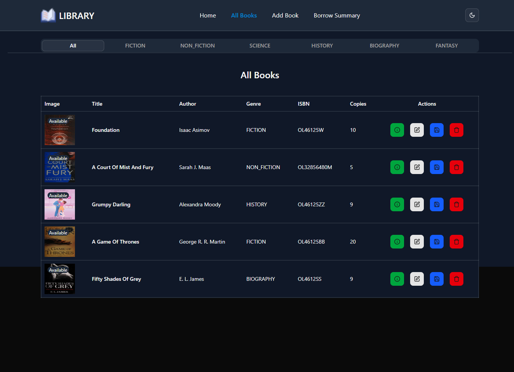
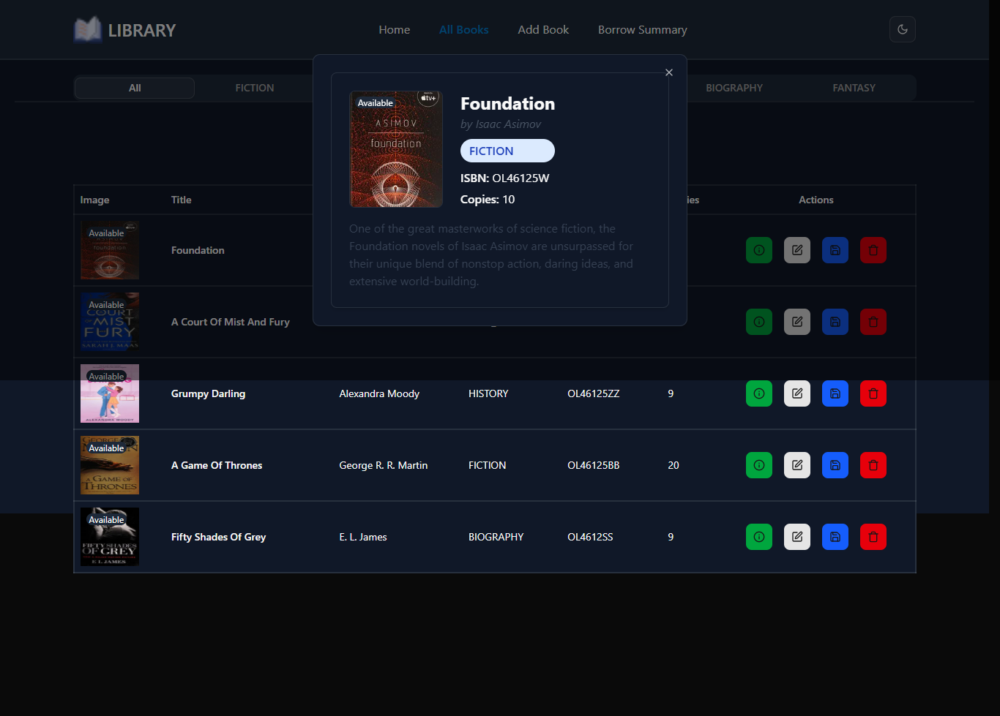
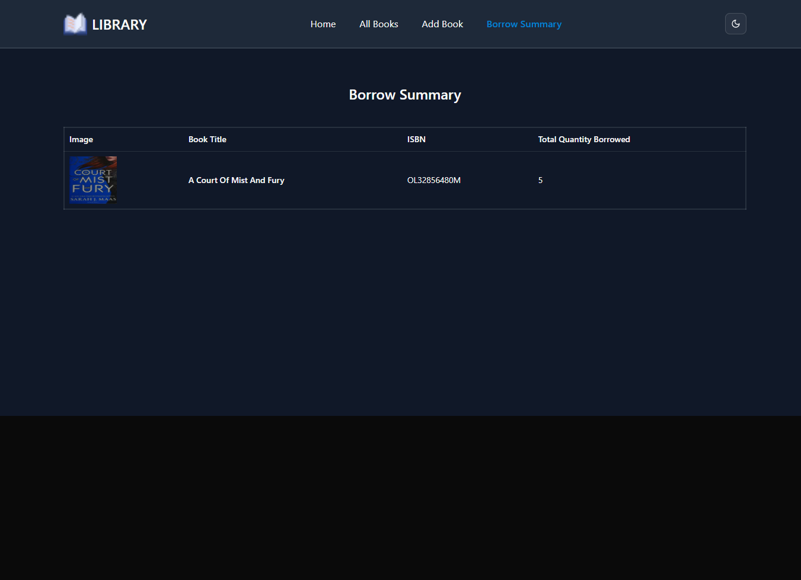

# 📚 Library Management System –Simple Full Stack (Frontend + Backend)

This is a full-stack Library Management System built using:

- 🌐 **Frontend:** React 19 + TypeScript + Vite + TailwindCSS + Redux
- ⚙️ **Backend:** Express.js + TypeScript + MongoDB + Mongoose
- ☁️ **Image Upload:** ImageKit
- 🧠 **Validation:** Zod + Mongoose validation

---

## 🚀 Live Deployment

- 🖥️ Frontend: [https://librarycient.vercel.app](https://librarycient.vercel.app)
- 🔧 Backend API: [https://librarybeckend.vercel.app](https://librarybeckend.vercel.app)

---

## 📦 Monorepo Structure

```
📦 level2_assignment_4/
┣ 📂client/ # Frontend app (React)
┃ ┣ 📂pages/
┃ ┣ 📂layout/
┃ ┣ 📜main.tsx
┃ ┣ 📜router.tsx
┃ ┗ 📜README.md # Optional client-specific docs
┣ 📂backend/ # Backend app (Express API)
┃ ┣ 📂app/
┃ ┃ ┣ 📂controller/
┃ ┃ ┣ 📂model/
┃ ┃ ┣ 📂middleware/
┃ ┃ ┣ 📂utils/
┃ ┃ ┣ 📂interface/
┃ ┃ ┗ 📜README.md # Optional backend-specific docs
┃ ┣ 📜app.ts
┃ ┣ 📜server.ts
┣ 📜README.md # ← This file (Monorepo Full Stack Overview)
```

---


## 🌐 Features

### 🔧 Backend (Express API)
- Book CRUD (Create, Read, Update, Delete)
- Image upload via ImageKit
- Borrowing system with quantity and due date
- Mongoose schema validation
- MongoDB aggregation for borrowing summary
- Automatic availability handling
- RESTful API with proper error handling

### 🖥️ Frontend (React App)
- Add book via form with image upload
- Browse books by genre
- View all books with filter/sort
- Borrow summary (aggregated)
- Modern UI with Tailwind + Radix UI
- Form validation with React Hook Form + Zod
- Use Redux for global state managemnet

---

## ⚙️ Setup Instructions

### ✅ Prerequisites

- Node.js 20.x
- MongoDB Atlas or local MongoDB
- ImageKit account (for image upload)

---

### 📁 1. Backend Setup

```bash
cd backend
npm install
```

### ➕ Environment Variables
```
DB_USER=yourMongoUser
DB_PASS=yourMongoPassword
IMG_PUBLIC_KEY=<from imgKit>
IMG_PRIVATE_KEY=<from imgKit>
IMG_URL_END_POINT=<from imgKit>

```
### ▶️ Start Backend Server
```
npm run dev
```

### 🎨 2. Frontend Setup
```
cd client
npm install

```
### ▶️ Start Frontend Dev Server
```
npm run dev
```

### 🔗 API Endpoints

| Method   | Endpoint                | Description                |
| -------- | ----------------------- | -------------------------- |
| `POST`   | `/api/books`            | Add new book (with image)  |
| `GET`    | `/api/books`            | List all books             |
| `GET`    | `/api/books/:id`        | Get single book            |
| `PUT`    | `/api/books/:id`        | Update book                |
| `DELETE` | `/api/books/:id`        | Delete book                |
| `GET`    | `/api/books/categories` | Get unique genres          |
| `POST`   | `/api/borrow`           | Borrow book                |
| `GET`    | `/api/borrow`           | Borrow summary aggregation |

### 📸 UI Preview

| 📷 Page   | 💬 Description                 |
| --------- | ------------------------------ |
| Home      | Genre categories               |
| Add Book  | Form with image upload         |
| All Books | Sort and filter                |
| Summary   | Borrow summary via aggregation |

### ScreeShots
#### home page

#### all book

#### modal

#### borrow summery

